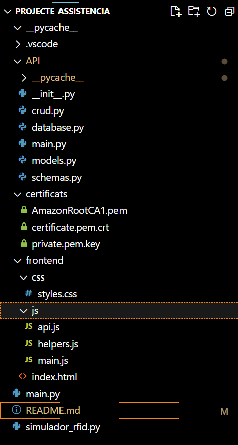

# Sistema de Control de Asistencias

## Introducción
Este proyecto es un sistema de control de asistencias desarrollado para gestionar la asistencia de estudiantes y profesores mediante tecnología RFID. El sistema está compuesto por una API REST (backend), una interfaz web (frontend) y un sistema de comunicación con dispositivos RFID a través de AWS IoT.

## Estructura del Proyecto



## Componentes Principales

### Backend (API)
- Desarrollado con FastAPI
- Gestiona operaciones CRUD para usuarios y asistencias
- Conexión a base de datos MySQL
- Endpoints principales:
  - `/usuarios/`: Gestión de usuarios
  - `/asistencias/`: Registro de asistencias
  - `/dashboard/`: Estadísticas generales

### Frontend
- HTML5, CSS3 y JavaScript vanilla
- Diseño responsive con Bootstrap
- Funcionalidades:
  - Dashboard con estadísticas
  - Registro de usuarios
  - Control de asistencias
  - Consulta de estadísticas por usuario

### Sistema RFID
- Integración con AWS IoT Core
- Comunicación MQTT para lecturas RFID
- Certificados de seguridad incluidos
- Simulador para pruebas incluido

## Base de Datos
La base de datos MySQL contiene las siguientes tablas principales:
- usuarios
- asistencias
- materias
- grupos
Aún que tiene mas tablas que se pueden ver en el diagrama de la base de datos, tienen su funcionalidad pero algnas no se han utilizado.

## Instalación Rápida

1. Clonar el repositorio
2. Configurar la base de datos MySQL
3. Instalar dependencias:

```bash
pip install fastapi uvicorn mysql-connector-python requests awsiotsdk
```

4. Ejecutar la API:
```bash
uvicorn API.main:app --reload
```

5. Abrir index.html en el navegador

## Notas Importantes
- Los certificados AWS deben configurarse correctamente
- La base de datos debe estar creada antes de iniciar el sistema
- El simulador RFID sirve para pruebas sin hardware real

## Pendiente
- Implementar autenticación de usuarios
- Mejorar manejo de errores
- Añadir más estadísticas
- Documentar endpoints específicos

## Problemas Conocidos
- A veces hay delay en lecturas RFID
- La conexión a AWS puede fallar si los certificados no están bien configurados
- Falta validación en algunos campos del frontend


